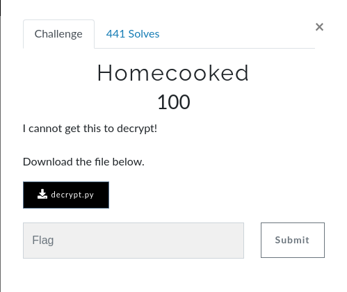

# Homecooked

## Question


>File attached: decrypt.py

## Answer

After looking at the code and analysing what the functions does we can see that function a checks if the number is prime while function b is its palindrome.

The problem was with the prime check it ran an O(n) complexity and thus took a long time. All I did was make it sqrt(n). Check the flag.py and wait a couple of secs and you will get the flag.

**flag:** ```flag{pR1m3s_4re_co0ler_Wh3n_pal1nDr0miC}```