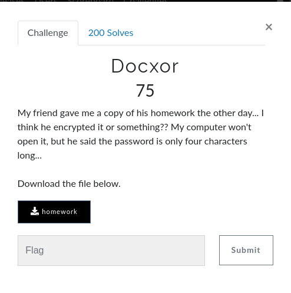
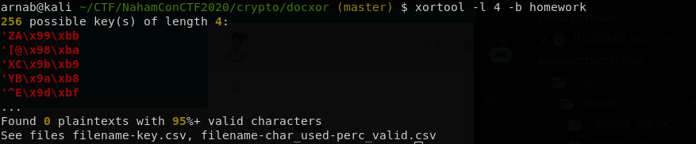
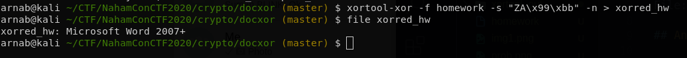

# Docxor

## Question



File: homework

## Answer

As the name suggests the actual data might have been xorred with a particular key and as said in the question that key is 4 length long.

We will use a tool called [xortool](https://github.com/hellman/xortool) which will brute force the key for us. 

```bash
$ xortool -l 4 -b homework
```


Lucky for us the first key was the required key. Because when I used the xortool-xor to decrypt the data I got a Mircosoft Word 2007+ file.

```bash
$ xortool-xor -f homework -s "ZA\x99\xbb" -n > xorred_hw
```


Now you can simply open it in Word or Libre Office or use binwalk to extract and run a grep you will get the flag.

**flag:** : ```flag{xor_is_not_for_security}```

<hr>

Also read:

1. https://github.com/W3rni0/NahamCon_CTF_2020#docxor