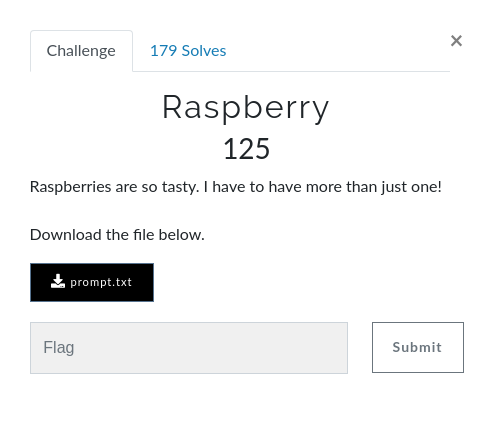

# Rasberry

## Question



>File attached: prompt.txt

## Answer

After putting the value of n in factordb.com I found that n was made up of more than 2 primes, so I calculated the phi(n) and did the classical decryption of RSA. 

```python
from Crypto.Util.number import *

n = 7735208939848985079680614633581782274371148157293352904905313315409418467322726702848189532721490121708517697848255948254656192793679424796954743649810878292688507385952920229483776389922650388739975072587660866986603080986980359219525111589659191172937047869008331982383695605801970189336227832715706317
e = 65537
c = 5300731709583714451062905238531972160518525080858095184581839366680022995297863013911612079520115435945472004626222058696229239285358638047675780769773922795279074074633888720787195549544835291528116093909456225670152733191556650639553906195856979794273349598903501654956482056938935258794217285615471681

factors =  [2208664111,2214452749,2259012491,2265830453,2372942981,2393757139,2465499073,2508863309,2543358889,2589229021,2642723827,2758626487,2850808189,2947867051,2982067987,3130932919,3290718047,3510442297,3600488797,3644712913,3650456981,3726115171,3750978137,3789130951,3810149963,3979951739,4033877203,4128271747,4162800959,4205130337,4221911101,4268160257]

phi = 1
for v in factors:
    phi *= (v-1)

d = inverse(e, phi)
res = pow(c, d, n)
print(bytes.fromhex(hex(res)[2:]).decode('ASCII'))
```

**flag:** ```flag{there_are_a_few_extra_berries_in_this_one}```