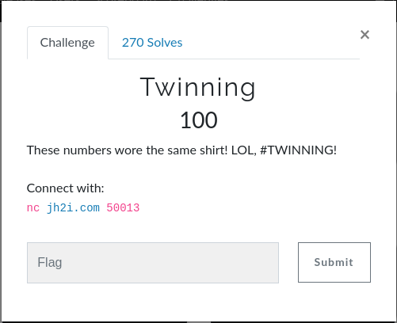
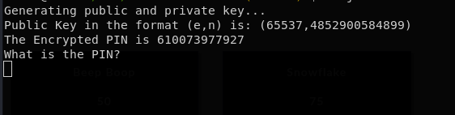
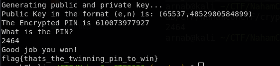

# Twinning

## Question


## Answer

Standard RSA encryption. After connecting to the endpoint i got



1. After getting n, go to factordb.com and factorise that. 
2. The reason we factorise is because we need phi(n) [The euler totient function]
   
   if n = p*q where p and q are primes then
   ```phi(n) = (p-1)*(q-1)```

3. Now find d, which is the inverse of e mod phi(n). Use the Crypto.Util.number library of Python3 which has an inverse function.
4. After you find d which is the private key, all you need to do is raise the encrypted text c to the power of mod n.

Check the rsa.py file.
After you put the pin you get the flag



**flag** ```flag{thats_the_twinning_pin_to_win}```
