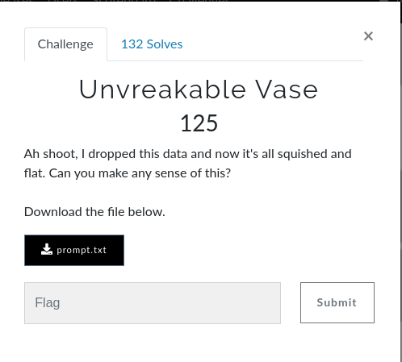

# Unbreakable Vase

## Question



## Answer

Couldn't solve during the contest.

It was evident that it was a base64 encoded string, but on decoding we don't get any recognisable string. The problem was that if there was any uppercase letter it became small case in the string due to "falling", Now we have to find bruteforce every character and check the result making it  upper case. Now that will require 2**52 possible checks, which is very large. But we can reduce this by understanding how base64 works. 
W3rni0 in his/her writeup explained it very nicely :

>But, we can do something else, base64 is using characters to represents the numbers from 0 to 63, if w'ill encode one letter from base64 to binary we get a binary string of length 6 bits, but each ascii character take 8 bits to encode, so if we want to find the smallest ascii substring that decodes to a base64 string without padding we'll need to find a lowest common multiple (LCM) value, for those numbers the LCM is 24, and s0 every 24/8 = 3 ascii characters are encoded to 24/6 = 4 base64 characters without padding and if we will split our ciphertext to blocks of 4 characters and try every possible combination of upper case and lower case on every character in each block until we get a readable substring (preferably of the flag which very likely though not guaranteed) w'ill need to try at most 2 to the power of 4 multipled by the number of blocks for every block, in out case (2 ** 4) * (52 / 4) = (2 ** 4) * 12 which is a lot less then what we had before, for that I wrote the following script which goes through every block in the ciphertext and tries all the possible combinations until the ascii strings decoded from the block are printable (in the range from space \x20 to tilda \x7e):

```python
from base64 import b64decode

# to check if the chars after decoding were printable
def checkChar(res):
    for ch in res:
        if ch <=126 and ch>=33:
            pass 
        else:
            return False
    
    return True

prompt = list('zmxhz3tkb2vzx3roaxnfzxzlbl9jb3vudf9hc19jcnlwdg9vb30=')
final = ''
for i in range(0, len(prompt), 4):
    for j in range(0, 2**4):
        curr_char = prompt[i:i+4].copy()
        for k in range(0, 4):
            if(j & (1<<k)):
                curr_char[k] = curr_char[k].upper()
            
        curr_res = b64decode(''.join(curr_char))
        if (checkChar(curr_res)):
            final += curr_res.decode('ASCII')
            break

print(final)
        
```

**flag:**```flag{does_this_even_count_as_cryptooo}```